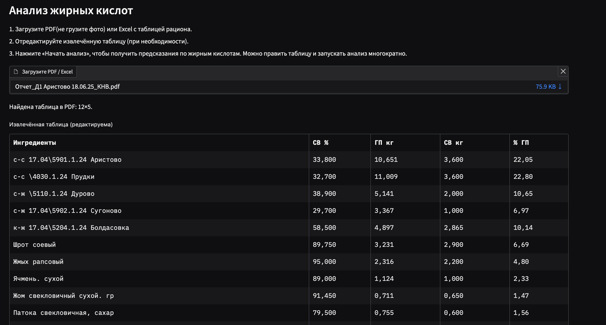
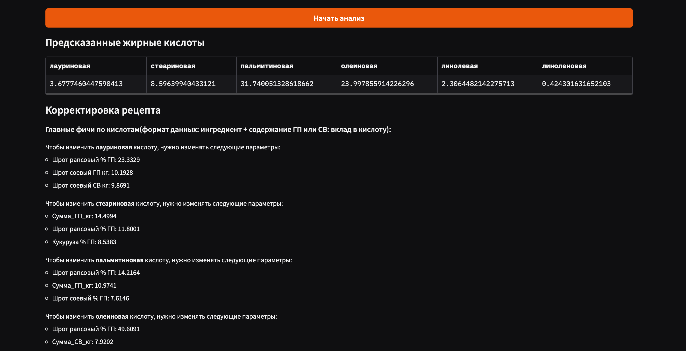

# EcoNiva-Cows


Наш мини-сервис прогнозирует состав содержание жирных кислот по ингридиентам и процентым долям рациона.

> Сервис предоставляет возможность загрузить pdf(текстовый)/excel файл и рационом, после нажатия на кнопку "Начать анализ" модель выдаст прогноз по жирным кислотам. Также снизу будет показано feature_importance для каждой кислоты

### Визуализация




### Загрузка и запуск
мы сразу подгрузили в репу kis.xlsx(и всякие файлы, которые собирались во время EDA), потому что он создавался из кусочков


для запуска установите python 3.13.+
```
git clone https://github.com/Sosylka19/EcoNiva-Cows.git && cd EcoNiva-Cows
```
```
1. python -m venv venv
```
```
2. macos/linux: source venv/bin/activate
windows: venv\bin\activate
```
```
3. pip install -r requirements.txt
```
```
4. python -m src.baseline
```

```
5. python -m gui.interface
```

и всё работает